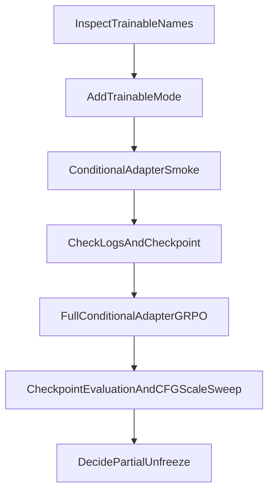

# Conditional Adapter GRPO Plan

## 目标

把当前 `matinvent_reference` 的 GRPO-lite 从无条件/全参微调扩展为：

- 加载条件模型，例如 `mattergen_dft_band_gap`
- 用 `properties_to_condition_on.dft_band_gap=3.0` 和 `diffusion_guidance_factor=4.0` 做 CFG 条件采样
- 冻结 backbone，只训练 adapter / condition embedding / property embedding 相关参数
- reward 使用 `bandgap_ehull` 或 ehull，加权优化条件命中与稳定性

## 当前关键事实

- 当前训练是全参微调：`pipeline/mat_invent.py` 中 `self.agent.parameters()` 全部 `requires_grad=True`，optimizer 也直接吃全部参数。
- 条件采样入口已经存在于 `models/mattergen/sample.py`：
  - `properties_to_condition_on`
  - `diffusion_guidance_factor`
  - sampler 中会把它映射到 `sampler_partial.guidance_scale`
- 条件模型必须加载对应 checkpoint；例如 bandgap 条件应使用 `/mnt/shared-storage-user/zhangsizhe/mattergen_steering_2/checkpoints/dft_band_gap`，不能用 `mattergen_base` 硬传条件。
- 你的现有条件配置里已有可复用参数：`dft_band_gap: 3.0`，`diffusion_guidance_factor: 4.0`。

## 具体操作步骤

1. 先做参数名诊断。

   在模型加载后临时打印或保存 `agent.named_parameters()` 中与以下关键词匹配的参数名：

   - `adapter`
   - `adapt`
   - `property`
   - `condition`
   - `cond`
   - `embedding`

   目的：确认 MatterGen 条件 adapter 的真实参数名，避免误冻结。

2. 给 pipeline 增加微调模式配置。

   在 `configs/pipeline/mat_invent.yaml` 增加类似配置：

   ```yaml
   trainable:
     mode: all        # all | adapter_only | pattern
     include_patterns: []
     exclude_patterns: []
     print_trainable: true
   ```

   推荐第一版使用：

   ```yaml
   trainable:
     mode: adapter_only
     include_patterns:
       - adapter
       - adapt
       - property_embeddings
       - property_embeddings_adapt
       - condition
       - cond
     print_trainable: true
   ```

3. 修改 `MatInvent.load_model()` 的冻结逻辑。

   当前逻辑在 `pipeline/mat_invent.py`：

   ```python
   for param in self.agent.parameters():
       param.requires_grad = True
   ```

   改为：

   - `mode=all`：保持现有全参微调
   - `mode=adapter_only`：只放开匹配 adapter/condition/property 的参数
   - `mode=pattern`：允许脚本传自定义 `include_patterns`

   同时打印 trainable parameter count、frozen parameter count、trainable parameter name list 前若干项。

4. 修改 optimizer 只接收可训练参数。

   当前 optimizer 在 `ft_step()` 中是：

   ```python
   optimizer = torch.optim.Adam(self.agent.parameters(), lr=cfg.lr)
   ```

   改为：

   ```python
   trainable_params = [p for p in self.agent.parameters() if p.requires_grad]
   optimizer = torch.optim.Adam(trainable_params, lr=cfg.lr)
   ```

   并在没有可训练参数时直接报错，防止配置误匹配导致空训练。

5. 确认条件字段能进入 finetune batch。

   条件采样返回的是 `ChemGraph`。需要确认采样得到的 `sample_list` 中保留了 `dft_band_gap` 或相关 condition 字段。

   如果字段已保留，`MatterGenDataset.from_samples()` 直接进入 dataloader 即可。

   如果字段丢失，需要在 `MatterGenDataset.from_samples()` 或 `sample_step()` 中把固定条件值写回每个 `ChemGraph`，例如每个训练样本都附带 `dft_band_gap=3.0`。

6. 写一个 conditional adapter smoke 脚本。

   建议新脚本：

   ```text
   run_on_h/smoke_grpo_lite_cond_bandgap_adapter.sh
   ```

   核心 override：

   ```bash
   model.model_name=mattergen_dft_band_gap
   +model.model_path=/mnt/shared-storage-user/zhangsizhe/mattergen_steering_2/checkpoints/dft_band_gap
   model.sample_cfg.properties_to_condition_on.dft_band_gap=3.0
   model.sample_cfg.diffusion_guidance_factor=4.0
   reward=bandgap_ehull
   pipeline.grpo.mode=lite
   pipeline.trainable.mode=adapter_only
   pipeline.replay=False
   rl_epoch=1
   eval_size=8
   ```

   第一版建议 `replay=False`，减少变量，确认条件链路和 adapter-only 训练没问题。

7. Smoke 验证标准。

   必须检查：

   - 日志里打印了 trainable 参数，且不是 0
   - trainable 参数名确实集中在 adapter/condition/property 相关模块
   - 采样没有触发 `cond_fields_model_was_trained_on` 断言失败
   - `reward mean/std`、`band_gap mean/std`、`ehull mean/std` 正常
   - `loss_diff`、`loss_kl` 有限
   - checkpoint 能保存

8. 写正式 conditional adapter 训练脚本。

   建议新脚本：

   ```text
   run_on_h/run_grpo_lite_cond_bandgap_ehull_adapter.sh
   ```

   推荐初始参数：

   ```bash
   RL_EPOCH=80
   EVAL_SIZE=64
   SAMPLE_BATCH_SIZE=32
   SAMPLE_NUM_BATCHES=3
   FT_BATCH_SIZE=32
   FT_TIMESTEPS=300
   FT_EPOCHS=2
   ACCUM_STEPS=50
   LR=1e-5          # adapter-only 可比全参稍大；若不稳降到 3e-6
   SIGMA=0.025
   TOPK_RATIO=0.5
   REPLAY=True
   BUFFER_SIZE=300
   SAMPLE_SIZE=16
   REWARD_CUTOFF=0.55
   GRPO_ADV_CLIP=3.0
   ```

   reward 推荐先用 `bandgap_ehull`，因为目标是优化条件生成能力，而不只是 ehull。

9. 评估方式。

   每个 checkpoint 后单独生成评估：

   - 使用同一 target：`dft_band_gap=3.0`
   - 比较不同 checkpoint 的 raw/relaxed bandgap 分布
   - 比较 ehull 均值、低 ehull 比例、多样性
   - 固定 CFG scale sweep：`1.0, 2.0, 4.0, 6.0`

   关键指标不是单纯 reward，而是：

   - bandgap 接近 3.0 的比例是否提升
   - ehull 是否没有明显恶化
   - CFG scale 变化时条件响应是否更稳定

10. 如果 adapter-only 到瓶颈，再做分阶段解冻。

    第二阶段才考虑：

    - `adapter + condition embedding + 最后 1 个 denoiser block`
    - 或更小 lr 的全参微调

    不建议一开始直接全参，因为会同时改变 unconditional 和 conditional 分支，破坏 CFG 差分语义。

## 推荐执行顺序



## 风险与处理

- adapter 参数名不确定：先诊断 `named_parameters()`，再确定 include patterns。
- 条件字段在 finetune batch 中丢失：需要把 `properties_to_condition_on` 写回 `ChemGraph` 或 dataset properties。
- reward 优化成无条件偏移：优先 adapter-only，并用 bandgap target reward 明确约束条件命中。
- KL 过大或 loss 不稳：降低 `LR` 到 `3e-6`，或增大 `SIGMA`。
- LMDB 冲突：继续使用 `~sample_cfg.filter`，避免 OptFilter 和 MatterSim 同时打开 reference LMDB。
